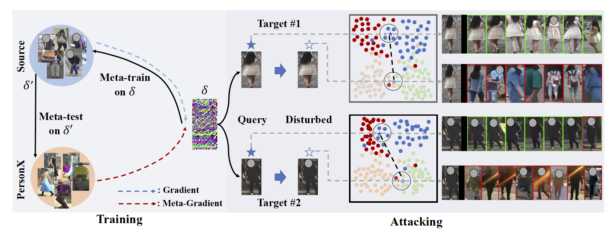
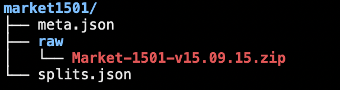
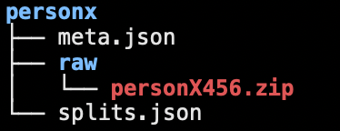

# Learning to Attack Real-World Models for Person Re-identification via Virtual-Guided Meta-Learning (AAAI 2021)

Code for AAAI 2021 paper ``Learning to Attack Real-World Models for Person Re-identification via Virtual-Guided Meta-Learning (AAAI 2021)".




## [Paper](pdfs/578_YangF.pdf)

## Supplemental Material (Coming Soon)

## Requirements:
* python 3.7
* CUDA==10.1
* Market1501, DukeMTMC-reID, MSMT-17 and [PersonX456](https://github.com/sxzrt/Instructions-of-the-PersonX-dataset).
* faiss-gpu==1.6.0
* Other necessary packages listed in [requirements.txt](requirements.txt)

## Preparing Data

* Clone our repo

Market-1501 (Duke and MSMT are the same):
* Download "Market-1501-v15.09.15.zip".
* Create a new directory, rename it as "data".
* Create a directory called "raw" under "data" and put "Market-1501-v15.09.15.zip" under it.
* The final structure should like this (meta.json and splits.json are generated by our code, please ignore them):



PersonX:
* Download full PersonX dataset from 
  https://github.com/sxzrt/Instructions-of-the-PersonX-dataset, 
  we use the CVPR'19 version.
* Merge "query" of "4", "5", "6" together (the same to "bounding_box_train" and "bounding_box_test").
* Put the merged "query", "bounding_box_train" and "bounding_box_test" to a new directory "personX456", 
zip it and put it to data/personx/raw
* The final structure should like this:



* There is a processed tar file in [BaiduYun](https://pan.baidu.com/s/1JHUIWVHJlkUERnjet5imwA) with all needed files,
  password: 4fqf. You can directly put it under "data" and unzip it.

## Preparing Models

* Download re-ID models from [BaiduYun](https://pan.baidu.com/s/1pVVppkp-GQew7g_R6L3IWA) (Password: tua2)


* Put models under logs/{datasetname}

## Run our code
 
See attack.sh for more information.

If you find this code useful in your research, please consider citing:

```
@inproceedings{yang2021meta,
  title={Learning to Attack Real-World Models for Person Re-identification via Virtual-Guided Meta-Learning.},
  author={Yang, Fengxiang and Zhong, Zhun and Liu, Hong and Wang, Zheng and Luo, Zhiming and Li, Shaozi and Nicu, Sebe and Shin'ichi Satoh},
  booktitle={AAAI},
  year={2021}
}
```

## Acknowledgments

Our code is based on [UAP-Retrieval](https://github.com/theFool32/UAP_retrieval), 
if you use our code, please also cite their paper.
```
@inproceedings{Li_2019_ICCV,
    author = {Li, Jie and Ji, Rongrong and Liu, Hong and Hong, Xiaopeng and Gao, Yue and Tian, Qi},
    title = {Universal Perturbation Attack Against Image Retrieval},
    booktitle = {ICCV},
    year = {2019}
}
```
## Contact Me

Email: yangfx@stu.xmu.edu.cn

